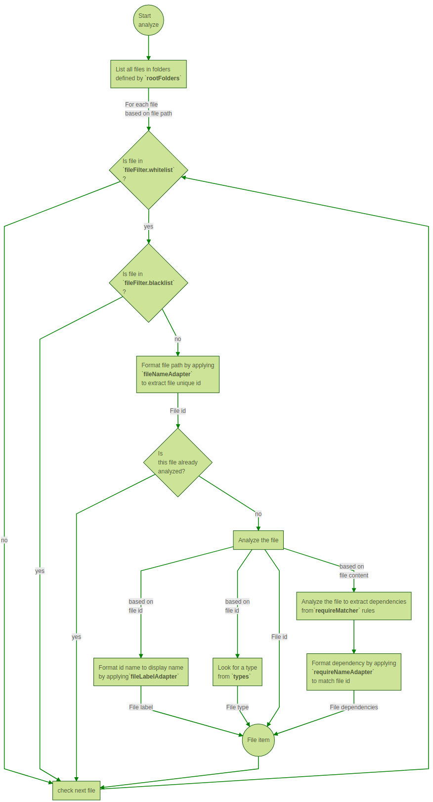

# Technical overview

* [File analyzer]
  * [Graph Workflow]
  * [Workflow explanation]

[Back to main page](../README.md)

[File analyzer]:#fileAnaylzer

## File analyzer

The file analyzer process runs at server side to build the dependeny tree of a given configuration.

It analyzes each file and extract their dependencies. The result is then given back to client to display this tree.

[Graph Workflow]:#workflow

### Graph workflow

Attributes in **bold** are from a *configuration* attribute.

(watch how to set [configuration attributes](configuration.md#ConfAttributes))

[Workflow explanation]:#workflowDetails

### Workflow explanation

 It is possible to set several *configuration*.

 The process is run every times a configurations is selected (by default the first one is selected at start) even if it was already done (like this it ensure to re-analyze files when a modification has been done.

#### Get all files
 Files are listed from root folders and all their sub-folders. It follows sym-link.

 **configuration.rootFolders** defines the first folders to analyze. It is possible to set several root folders for projects where files are located at different places but will be computed in only one place in the final build.

File are, in fact, treated one by one, so if a sub-folder matches a blacklist rule, no files will be analyzed. This may be helpful to prevent sym-link loops.

#### Filters

**configuration.fileFilter.whitelist** and **configuration.fileFilter.blacklist** defines rules to keep (whitelist) or reject (blacklist) some files to analyzis. Rules are applied on the file path.

The file must fulfill both rules to be analyzed.

If it matches a rule from black list the file will not be analyzed even if it matches white list rules.
If black list is empty, no files will be rejected.

To be accepted, a file must match at least one rule in white list.
If white list is empty, all files are accepted (except the ones which math black list).

#### Get file id

File id is built to identify files reference. This can be the full path but sometimes it is better to trunc it to something shorter (which looks like what is used by dependency link).

It must be unique for the same file. A file which have the same id than another one will not be analyzed (as it is considered as the same file as the previous one). Different path for the same file ussually occurs in project which has sym-links.

All replacement rules defined by **configuration.fileNameAdapter** are applied on the full path to build the *file id*.

#### Get file label

File label is the name which will be displayed in the GUI inside boxes. It is better if it is shorter but it is up to you to choose what will be displayed.

This is oftenly the name of the file (without its path).

All replacement rules defined by **configuration.fileLabelAdapter** are applied on the file id to build the *file label*.

#### Get file type

File type is only to group similar files in same categories. It is possible to apply similar style on file with same type.

Type matchers and type styles are defined in **configuration.types**.

#### Retrieve dependencies

The file content will be analyzed to extract all informations about dependencies. This will create links from this file to these dependencies.

Dependencies are extracted from file content by applying **configuration.requireMatcher** rules. The result of any matching rule will then be processed by replacement rules **configuration.requireNameAdapter** to get the dependency file id.

The link will work correctly only if this dependency id matches a file id.

#### Build a file item

A file item is built by building informations about the analyzed file: **file path**, **file id**, **file label**, **file type**, **file dependencies**...

For security reason, only some informations are available to client.

[Back to main page](../README.md)